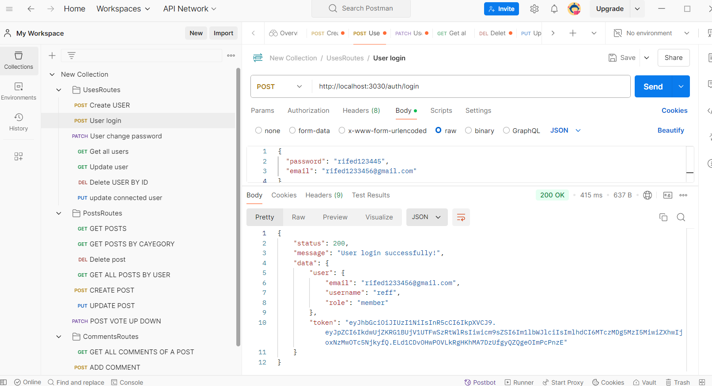
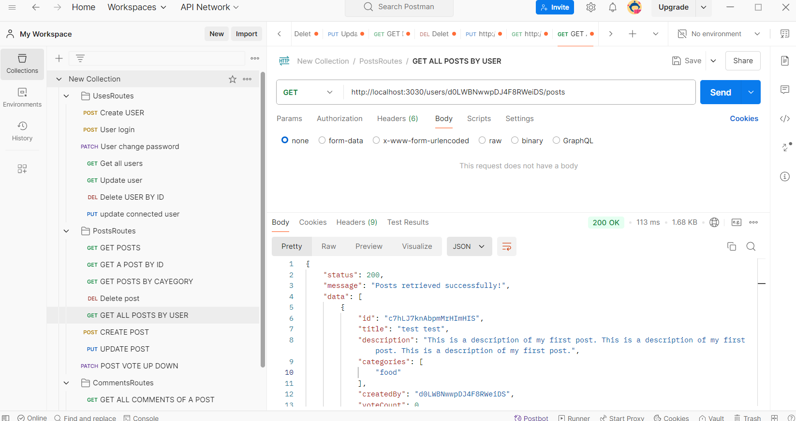
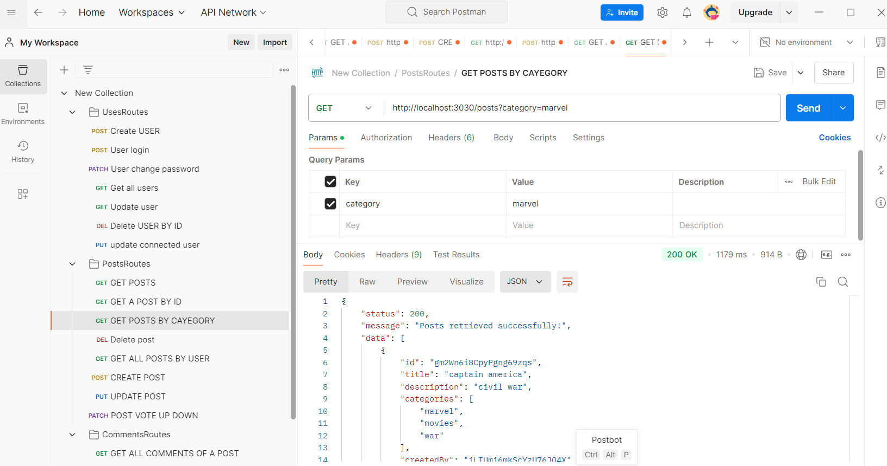
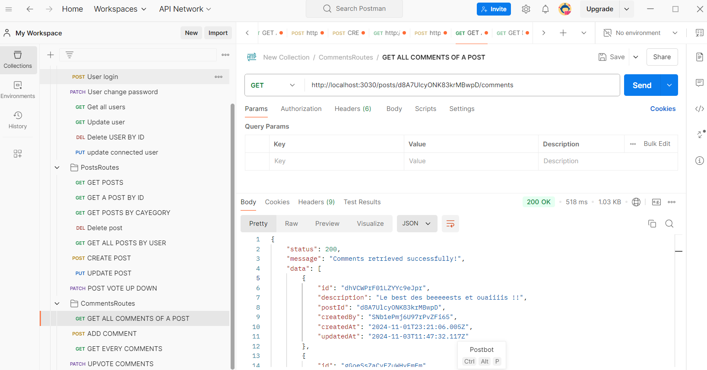
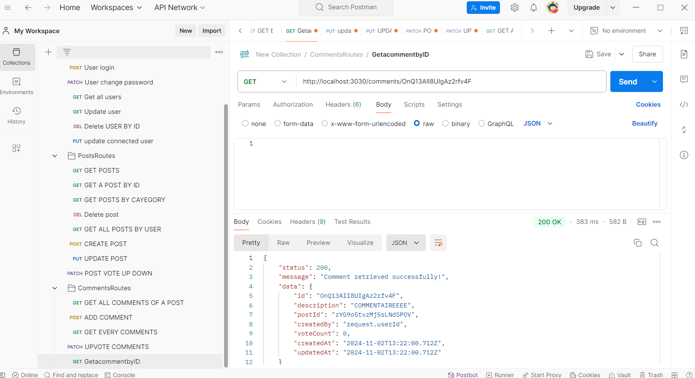
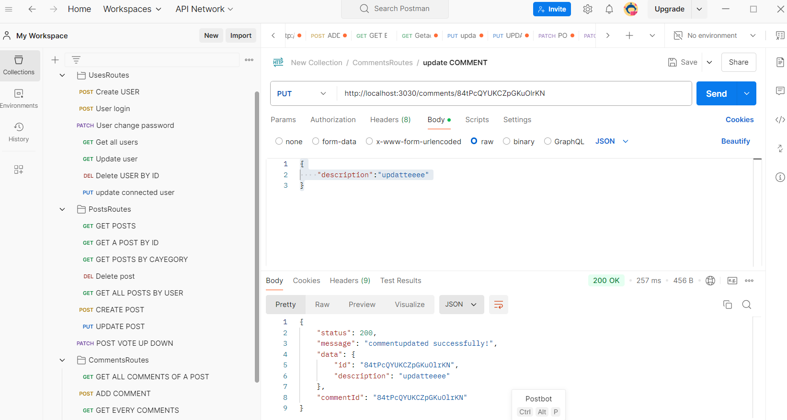
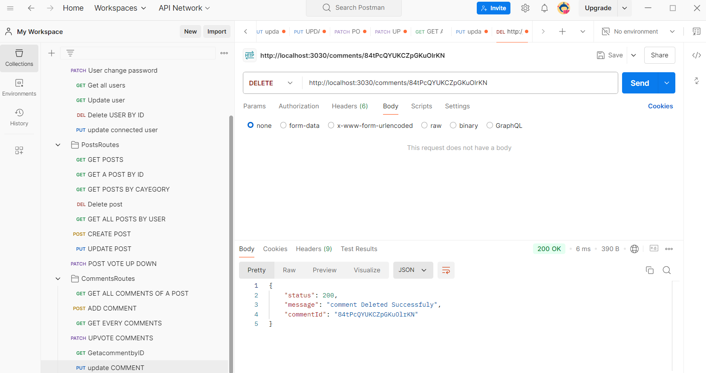
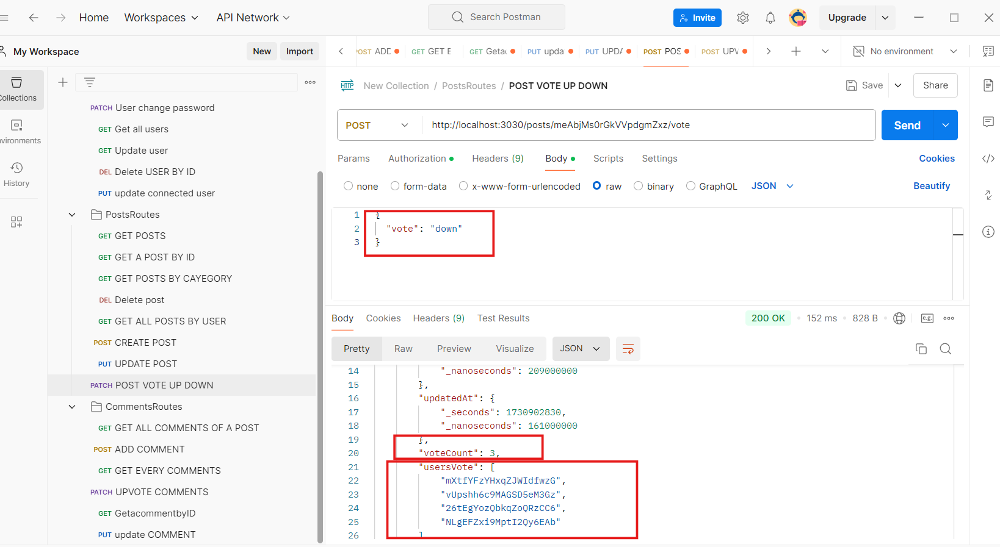
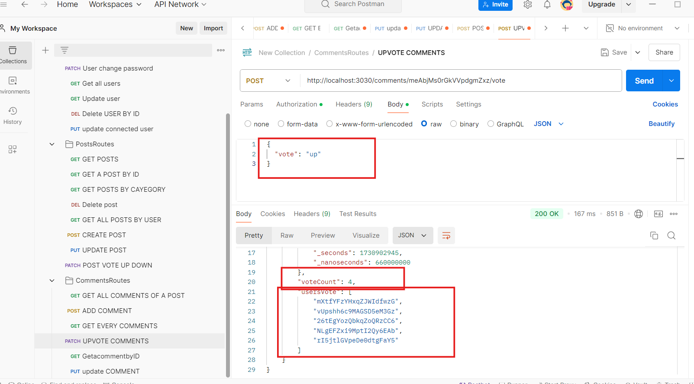

# SyncVote Rest API

Nodejs (TypeScript)


## Installation

Install the project dependencies

```bash
npm install
```

## Developing

Copy **.env.example** and name it **.env** and set the env variables.

Run the development server:

```bash
npm run dev
```

Open [http://localhost:8080](http://localhost:8080) with your browser to see the result.


### Create a new admin

```bash
npm run create-admin
```
# ---------------- #
# Usersroutes  
# ---------------- #
# Create USER : 


# User login : 


# User Update : 
 

 # Get all users :
 

 # Change user informations :
 

 # update connected user informations (1 - saisie de token): 

 # update connected user informations ( 2 - saisie de nouveau informations de user ): 


 # Delete user :


# ---------------- #
# PostsRoutes 
# ---------------- #
 # GetallPOSTS :

 
# GetPostbyID : 
  

# Updatepost : 


# Deletepost : 


 # Getallpostsbyuser :


 # GetallGetpostsbycategory :
 


 # ------------------------ #
 # Comments & Votes Routes : 
 # ----------------------- #

 # GET ALL COMENTS OF A POST  :


 # Get a comment by ID :


 # Addacommenttoapost 


 # Update comment
 

 # Deleted comment


 # Post-Upvote/Downvote


 # Comment-Upvote/Downvote



